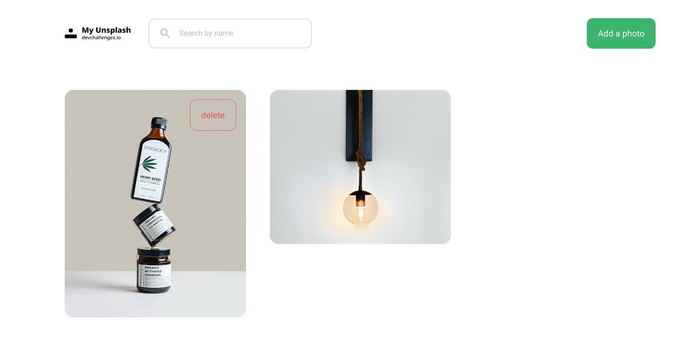

<!-- Please update value in the {}  -->

<h1 align="center">My Unsplash</h1>

<div align="center">
   Solution for a challenge from  <a href="http://devchallenges.io" target="_blank">Devchallenges.io</a>.
</div>

<div align="center">
  <h3>
    <a href="https://my-devchallenge-unsplash.netlify.app/">
      Demo
    </a>
    <span> | </span>
    <a href="https://my-devchallenge-unsplash.netlify.app/">
      Solution
    </a>
    <span> | </span>
    <a href="https://devchallenges.io/challenges/rYyhwJAxMfES5jNQ9YsP">
      Challenge
    </a>
  </h3>
</div>

<!-- TABLE OF CONTENTS -->

## Table of Contents

- [Overview](#overview)
  - [Built With](#built-with)
- [Features](#features)
- [How to use](#how-to-use)
- [Contact](#contact)
- [Acknowledgements](#acknowledgements)

<!-- OVERVIEW -->

## Overview



My Unsplash is a project that allows users to store links to their photos for _6 months_. It supports searching for photo links you have added by the names you give to them.

I as usual used [Sveltekit](https://kit.svelte.dev/) to build the project. For the database, I decided to go with [Xata](https://xata.io) partly because they have a generous free tier and they have a very good database client for querying data and working with it.

One of the things I learned was using `columns` in tailwindcss to create the masonry layout. I initially tried with css grid but I just couldn't get it to work properly as sometimes some of the images were not occupying the full height of their parent element and if I choose to strictly give them a fixed height then some of them will also look weird. So as usual, I did some searching on google and found an article on [masonry layout](https://prototypr.io/post/masonry-layout-css-tailwind) using tailwindcss `colomns` and that did the trick.

Also, I did opt for **svelte stores** in building the modal which I have not really done before. What I still find challenging and is not really the best is that when I load the page, it takes a few miliseconds before the modal starts to work. Thus, the page loads but when you click the button immediately, it does not work, it works perhaps in the second try and I realized there was a slight delay before it worked. I am not exactly sure why, I am assuming the it's because the javascript is being initialized or hydrated in the dom but I am not 100% sure. I will leave it for now and if I were to find the solution later, I will update it and also add what I found here.

Feel free to suggest or provide feedback on how I could fix the modal taking a bit of time to initialize issue if you know how. I will really appreciate your feedback.

### Built With

<!-- This section should list any major frameworks that you built your project using. Here are a few examples.-->

- [Sveltekit](https://kit.svelte.dev/)
- [Tailwind](https://tailwindcss.com/)
- [Xata](https://xata.io/)

## Features

- Add links and labels to your photos
- Search your added links and photos by the label or name
- View the added photos for 6 months.

## How To Use

### Prerequisite

- Create a database on Xata [Xata](https://xata.io/).
- Add the schema to the database:
  - [database schema](./static/schema.png)
- Update your `.xatarc` database url to your xata database url
- Login to xata if you have not already in your command prompt using the xata cli
- Add your environment variables

```bash
# if you have not installed xata cli, install it
npm i --location=global @xata.io/cli@latest

# login if you have not already done so
xata auth login

# update the .env variables with your xata database credentials
cp .env.example .env
```

To clone and run this application, you'll need [Git](https://git-scm.com) and [Node.js](https://nodejs.org/en/download/) and [pnpm](https://pnpm.io/) installed on your computer. From your command line:

```bash
# Clone this repository
$ git clone https://github.com/discoverlance-com/my-unsplash

# Install dependencies
$ pnpm install

# Run the app
$ pnpm dev
```

## Acknowledgements

- [Steps to replicate a design with only HTML and CSS](https://devchallenges-blogs.web.app/how-to-replicate-design/)
- [Node.js](https://nodejs.org/)
- [Marked - a markdown parser](https://github.com/chjj/marked)
- [Masonry layout using tailwindcss](https://prototypr.io/post/masonry-layout-css-tailwind)

## Contact

- Website [discoverlance](https://discoverlance.com)
- GitHub [@discoverlance-com](https://github.com/discoverlance-com)
- Twitter [@Discoverlance](https://twitter.com/Discoverlance)
